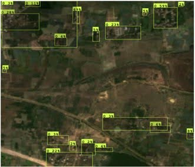
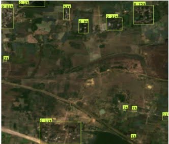
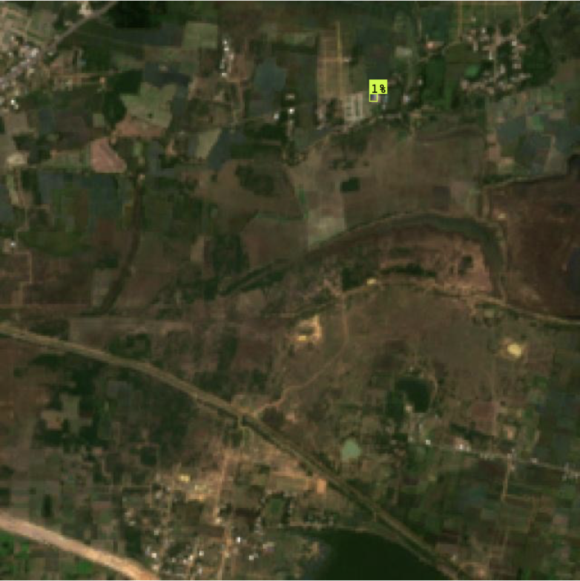
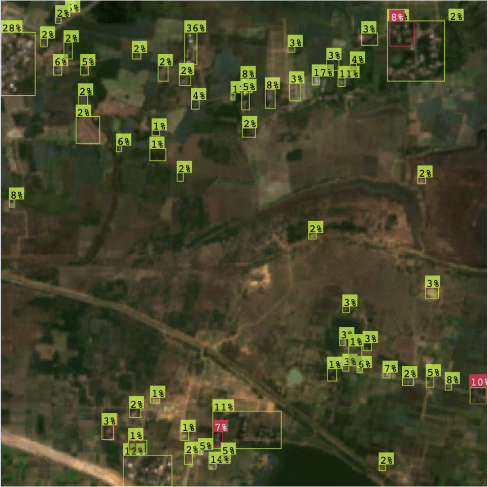

# Building detection using Satellite imagery in South India
This project detects buildings on Sentinel 2 satelite images and was trained using YOLOv8 and Roboflow. The models were evluated on satellite data covering parts of Tamil Nadu.
The models correspond to the labeling methods:  first model is based on manual labels and the second model uses external lables. We tested different dataset of external labels to study which performs better.

## Data Aquisition
To obtain the sentinel-2 data, [this](data/tile_download_script.py) Google Earth Engine script was created. In order to use it, one has to register to Google Cloud, create a project and use tile_download_script.py on the [Google Earth Engine Editor](https://code.earthengine.google.com. )
The data is made up of .tif files of the specified region.
## Data Preperation
Now the .tif files need to be split into smaller tiles in order to reduce the amount of labels on one tile and increase readability. The next step converts the .tif files into .jpg. The third does the automatic labeling. The first version creates bounding boxes around every single instance (fine), the second version merges nearby instances (condensed). The last steps upload the labeled data to Roboflow. The data preparation can be done on this [Google Colab](data/TileConvertingAndLabeling.ipynb)
and requieres a connected Google account. For manual labeling we used [Make Sense AI](https://www.makesense.ai/).
## Model Training
Once the data has been prepared, the training can begin. We used the [YOLOv8 Object Detection Google Colab](https://colab.research.google.com/github/roboflow-ai/notebooks/blob/main/notebooks/train-yolov8-object-detection-on-custom-dataset.ipynb) from Ultralytics linked to our Roboflow account. We modified the Colab in order to incorporate our Google Drive and removed unused features. This version can be found [here](training/modified_yolov8_object_detection.ipynb). The relevant training metrics can be viewed [here](/training/training_metrics).

## Results
### Manual label model
The base model with manual labels contains 646 images. We trained the data using different benchmarks. First, with 25 epochs and learning rate of 0.01. As shown in Figure 1a model can detect the groups of buildings, although with less confidence. To improve the accuracy of the bounding boxes, we increased epochs to 30 and decreased the learning rate to 0.001. This led to a slight improvement in our results (Figure 1b).

## Results
### Manual label model
The base model with manual labels contains 646 images. We trained the data using different benchmarks. First, with 25 epochs and learning rate of 0.01. As shown in Figure 1a model can detect the groups of buildings, although with less confidence. To improve the accuracy of the bounding boxes, we increased epochs to 30 and decreased the learning rate to 0.001. This led to a slight improvement in our results (Figure 1b)

  

    
    
  

  
<b>Figure 1:</b> (a) Training with 25 epochs, LR=0.01 | (b) Training with 30 epochs, LR=0.001

Table 1: Performance Metrics of Manual label models at Different Epochs and Learning Rates (percent)

| Configuration | mAP | Precision | Recall |
|:---|:---:|:---:|:---:|
| Epochs 25, learning rate 0.01 | 19.3 | 27.2 | 29.2 |
| Epochs 30, learning rate 0.001 | 26.7 | 34.8 | 33.0 |

### External label model
External labels from Open Building data enabled us to cover a wider area compared to the manual label method. In this model, we tested with two different versions of the Building labels. One model was trained with a **fine-label** dataset with very granular labels that cover the two polygons with 10,000 images. We also trained another model using **condensed labels** by merging labels that were close together into larger bounding boxes to test how results would vary between the manually labeled model and the fine-labeled model.

## Results
### Manual label model
The base model with manual labels contains 646 images. We trained the data using different benchmarks. First, with 25 epochs and learning rate of 0.01. As shown in Figure 1a model can detect the groups of buildings, although with less confidence. To improve the accuracy of the bounding boxes, we increased epochs to 30 and decreased the learning rate to 0.001. This led to a slight improvement in our results (Figure 1b).

  

    
    
  

  
<b>Figure 2:</b> (a) Fine labels | (b) Condesned labels 

We used 25 Epochs for the finely labeled model, but increased the Epochs to 100 for the condensed label model to improve our results. We observed a significant reduction in the performance of the model compared to the manually labeled model. Using condensed labels did improve the results a little, but not significantly. 

Table 2: Performance Metrics for External Label Models (percent)

| Configuration | mAP | Precision | Recall |
|:---|:---:|:---:|:---:|
| Fine labels | 1.3 | 1.8 | 0.1 |
| Condense labels | 7.9 | 12.6 | 6.2 |

The decline in metrics can be attributed to several factors. First, the fine-grained labels were incompatible with our low-resolution Sentinel-2 imagery. Second, potential misalignment between georeferenced footprints and satellite imagery resulted in bounding boxes that did not accurately correspond to visible features. Third, the labels may contain temporal inconsistencies due to new construction or unupdated demolitions. Similar challenges have been documented in studies utilizing comparable label datasets. While image augmentation techniques have proven effective in addressing resolution limitations in Sentinel-2 data, resource and time constraints prevented their implementation in this study. Consequently, improved performance is anticipated with a larger dataset and enhanced image preprocessing.
